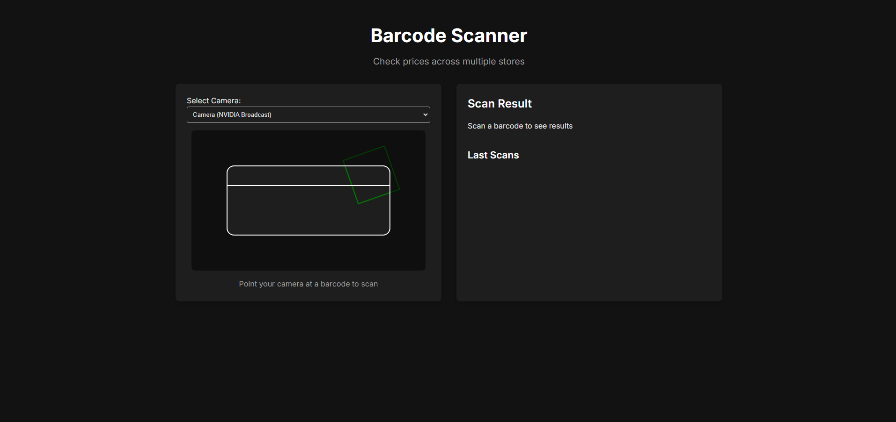
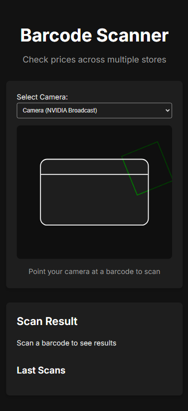

# Barcode Scanner - Multi-Store Price Checker


[](https://github.com/MohdYahyaMahmodi/barcode-scanner)

A web-based barcode scanner that allows users to check prices across multiple online stores. Built with JavaScript and the Quagga.js library, this application supports Progressive Web App (PWA) features for an enhanced user experience on both desktop and mobile devices.

<p align="center">
  
</p>

## Features

- 📷 Real-time barcode scanning using device camera
- 🔄 Multiple camera support with easy switching
- 🔍 Instant search across popular online stores (Google, Amazon, Walmart, Target)
- 💾 Local storage of scan history
- 📱 Responsive design for both desktop and mobile devices
- 🏠 PWA support for home screen installation and app-like experience

## Table of Contents

- [Installation](#installation)
- [Usage](#usage)
- [PWA Features](#pwa-features)
- [How It Works](#how-it-works)
- [License](#license)
- [Contact](#contact)

## Installation

1. Clone the repository:
   ```
   git clone https://github.com/MohdYahyaMahmodi/barcode-scanner.git
   ```
2. Navigate to the project directory:
   ```
   cd barcode-scanner
   ```
3. Open `index.html` in your web browser or set up a local server.

For PWA functionality, you need to serve the app over HTTPS. You can use GitHub Pages or any other HTTPS-enabled hosting service.

## Usage

1. Allow camera access when prompted by your browser.
2. Select your preferred camera from the dropdown (if multiple are available).
3. Point your camera at a barcode.
4. Once scanned, click on the store buttons to search for the product.
5. Optionally, save the scan with a custom name for future reference.

<p align="center">
  
</p>

## PWA Features

This application supports Progressive Web App features:

- 📲 Install on home screen for quick access
- 🏃‍♂️ Faster load times after initial visit
- 🖥️ Full-screen mode for an app-like experience

To install the PWA:
1. Open the app in a supported browser (e.g., Chrome, Edge)
2. Click the install button in the address bar or browser menu
3. Follow the prompts to add the app to your home screen

## How It Works

The application consists of three main files:

1. `index.html`: Structures the web page and includes necessary scripts and PWA metadata.
2. `style.css`: Provides styling for a responsive and user-friendly interface.
3. `app.js`: Contains the core functionality of the barcode scanner.

### Key Components:

- **Camera Initialization**: Uses `navigator.mediaDevices` to access the device's camera.
- **Barcode Scanning**: Utilizes Quagga.js to detect and decode barcodes in real-time.
- **Multi-Store Search**: Generates links to search for the scanned barcode on various online stores.
- **Scan History**: Manages a list of recent scans using browser's local storage.
- **PWA Support**: Implements a web app manifest and necessary meta tags for installability.

### Barcode Detection Process:

1. Continuously captures video frames from the camera.
2. Processes each frame to detect potential barcodes.
3. Decodes detected barcodes and validates the result.
4. Updates the UI with the scanned barcode and search options.

## License

This project is licensed under the MIT License - see the [LICENSE](LICENSE) file for details.

## Contact

Mohd Mahmodi

[](https://twitter.com/mohdmahmodi)
[](https://instagram.com/mohdmahmodi)

- Website: [mohdmahmodi.com](https://mohdmahmodi.com)
- Email: contact@mohdmahmodi.com

---

### Acknowledgements

- [Quagga.js](https://github.com/serratus/quaggaJS) for barcode scanning functionality
- [Font Awesome](https://fontawesome.com) for icons
- [Inter Font](https://fonts.google.com/specimen/Inter) by Rasmus Andersson